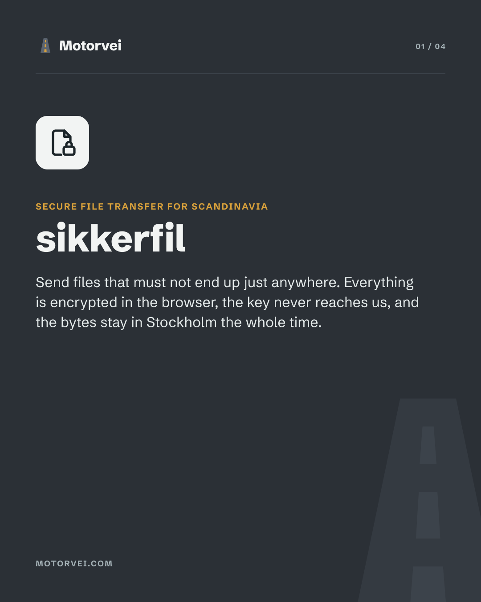
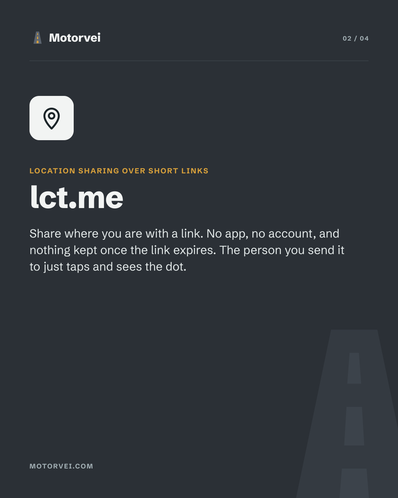
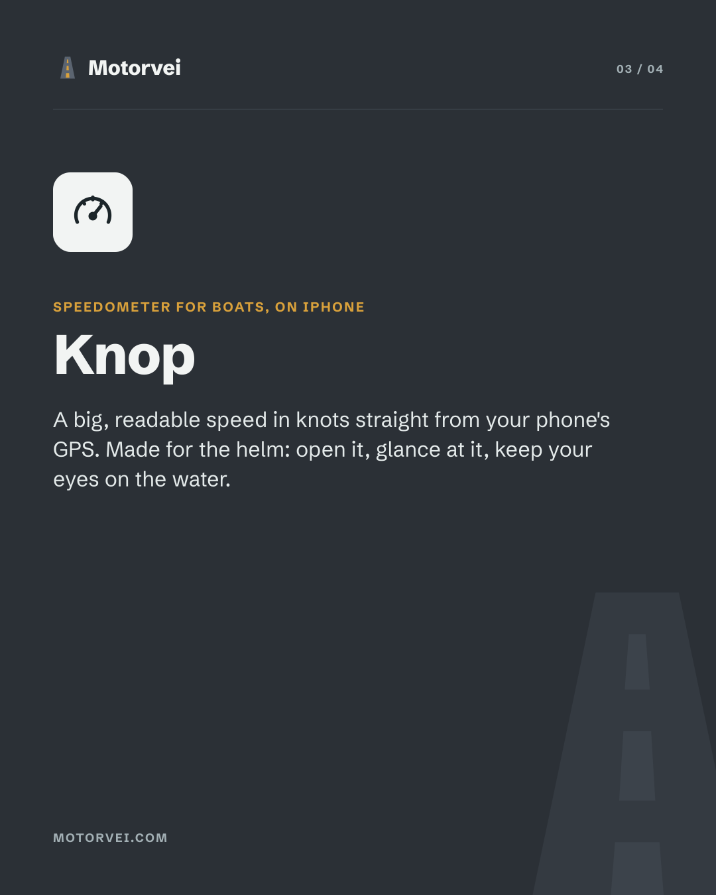
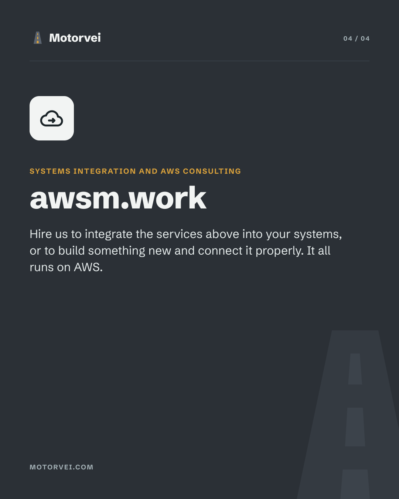

Motorvei is a Norwegian studio making focused internet services. Each one does
a single job, keeps as little of your data as it can, and tells you exactly
where the rest of it lives.

  
  
  
  

## What we make

- **[sikkerfil](https://sikkerfil.no/)**: Secure file transfer for Scandinavia. Files are encrypted in the browser, the key never reaches us, and the bytes stay in Stockholm. Also at [sakerfil.se](https://sakerfil.se/) and [sikkerfil.dk](https://sikkerfil.dk/). [API](https://sikkerfil.no/utviklere) · [Python client](https://github.com/motorvei/sikkerfil-py)
- **[lct.me](https://lct.me/)**: Location sharing over short links. No app, no account, and nothing kept once the link expires. [API](https://lct.me/v1/openapi.json)
- **[Knop](https://apps.apple.com/no/app/knop/id1032908358)**: Speedometer for boats, on iPhone. A big, readable speed in knots straight from the phone's GPS.
- **[awsm.work](https://awsm.work/)**: Systems integration and AWS consulting: we connect the services above to your systems, or build something new.

## Open source

- [`sikkerfil-py`](https://github.com/motorvei/sikkerfil-py): Python client for the sikkerfil API.

 

<a href="https://www.motorvei.com/">
  <picture>
    <source media="(prefers-color-scheme: dark)" srcset="images/motorvei-logo-dark.png">
    
  </picture>
</a>

Made in Norway · [motorvei.com](https://www.motorvei.com/) · [motorvei.no](https://www.motorvei.no/)
